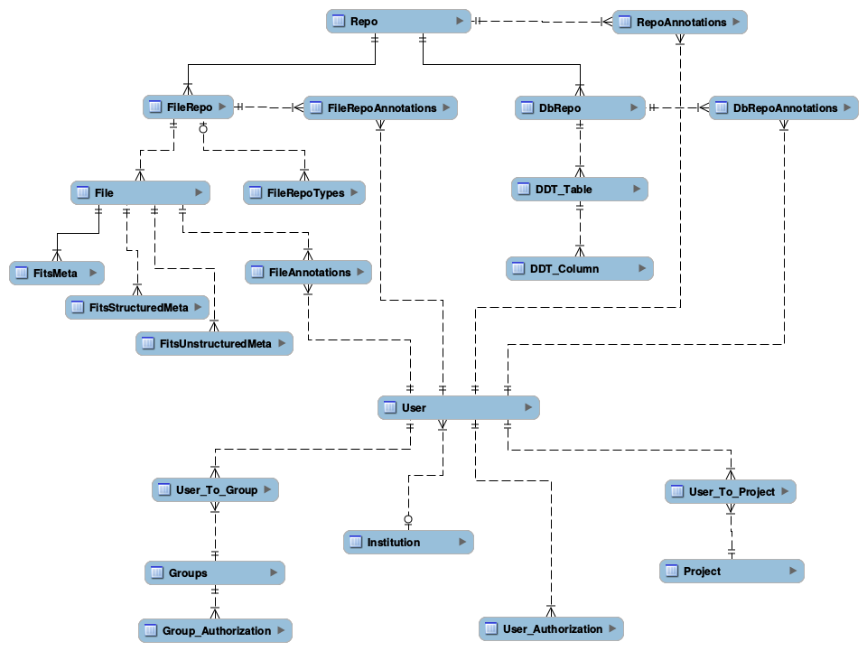
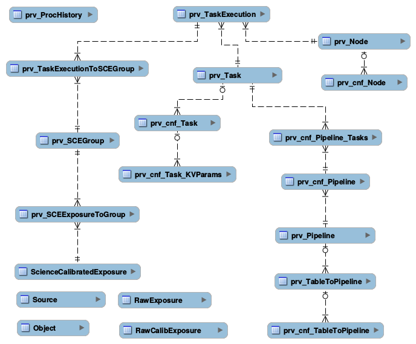

# LSST DM Metadata and Provenance

Metadata encompasses all information *about the data*, including data descriptions, locations, and annotations. Capturing, maintaining, and providing efficient access to metadata is as important as capturing, maintaining and providing efficient access to the data itself.

Provenance is typically considered a subset of metadata. Provenance is fundamentally concerned with two things: (1) recording the state of relevant portions of the system and (2) associating state with the generation of an output from inputs. Capturing provenance is essential for a variety of reasons; the top two being (1) ability to rebuild data products too large to cost-efficiently store persistently, such as ScienceCalibratedExposures, and (2) ability to run forensic analysis in order to understand data lineage when "something goes wrong".

In LSST, all data is organized into *repositories*. Examples of an LSST repository include a database containing a complete data release, a set of raw exposures used by a Data Release Processing, a group of exposures brought by L3 user from other survey, or a database with a small table produced by L3 user. Information about repositories (the "metadata") is managed through Central Metadata Store. Provenance information on the other hand is kept closely with the data: for a database repository it is kept inside the database, for a file repository it is kept in the *related* database repository as explained in the following sections.

## 1. Central Metadata Store

The Central Metadata Store (CMS) keeps track of all LSST DM repositories, with the exception of temporary data that L3 users consider scratch space that does not need to be tracked, backed up and maintained in a production manner. One CMS is maintained for each Data Center. The information kept in CMS can be in particular useful for "discovering" repositories based on most common search criteria, such as owner, creation time, type, etc. It is available through two interfaces: (a) RESTful API (Webserv), and (b) direct SQL querying.

 The diagram below depicts links between different tables used for CMS.

*Note that the existing version of all metadata tables mentioned here serves as a "skeleton". Additional commonly accessed fields will be added to these tables as deemed necessary to efficiently support most common queries.*

### 1.1 Metadata about Repositories

CMS keeps basic, high-level information about each repository, using the following set of tables:

 * *Repo* - this table contains exactly one entry per repository, independently of the repository type
 * *RepoAnnotations* - captures annotations users might want to attach to a repository

The schema definition of the above tables can be found at [repo.sql](https://github.com/lsst/dax_metaserv/blob/tickets/DM-3962/sql/repo.sql). A more detailed, fine-grained, type-specific information is kept in additional tables, as described below. Richer, repository-specific details can be fetched ad-hoc as needed directly from each repository.

### 1.2 Metadata About Databases

Information about database repositories is kept in several tables:

* *DbRepo* captures basic information about database repositories, alongside connection information
* *DbRepoAnnotations* captures annotations users might want to attach to a database repository
* *DDT_Table* captures LSST-specific table-level metadata. At the moment, the only field there is a detailed description
* *DDT_Column* captures LSST specific column-level metadata, such as UCD, units, precision that SUI should use by default when displaying values for the column, show/don't show in SUI by default

For details, see [dbRepo.sql](https://github.com/lsst/dax_metaserv/blob/tickets/DM-3962/sql/dbRepo.sql). Again, the current version is a skeleton that will be filled with more fields as we keep learning what information is most useful to store.

### 1.3 Metadata About Files

Information about file repositories is kept in the following tables:

* *FileRepo* - this table contains exactly one entry per file-type repository. Keeps file-repository specific metadata information
* *FileRepoTypes* - contains information about types of files stored in a given file repository
* *File* captures basic information about the file
* *FileAnnotations* captures annotations users might want to attach to a file
* *FitsMeta* and *FitsUnstructuredMeta* captures FITS file specific information

For details, see [fileRepo.sql](https://github.com/lsst/dax_metaserv/blob/tickets/DM-3962/sql/fileRepo.sql). Additional fields and tables for additional file types are expected to be added in the future.

### 1.4 Metadata About Users

Current prototype contains structures for keeping information about users, groups they belong to, and authorization information. This is kept in the following tables: *User*, *Institution*, *Project*, *User_Authorization*, *Groups*, *Group_Authorization*, *User_To_Group*. The actual structure can be found at [userAuth.sql](https://github.com/lsst/dax_metaserv/blob/tickets/DM-3962/sql/userAuth.sql).

(*Note that this will have to be re-thought and merged with the authorization/authentication efforts carried by NCSA, see e.g. [Managing L3 Data Access](https://confluence.lsstcorp.org/display/LAAIM/Managing+L3+Data+Access)*)

## 2. Provenance

As said earlier, provenance information is kept close to the data. Provenance structure highly depends on the origin of data, as well as the type of repository. From the perspective of data origin, repositories can be divided into four distinct groups.

1. Produced by the LSST camera. An example of such repository is a set of RawExposures
2. Produced by LSST pipeline. Examples of such repositories: a set of L1 DifferenceExposures, a L2 Data Release catalog, or a L3 user data set generated using an LSST pipeline (possibly with custom algorithms)
3. Produced by custom L3 user software
4. Brought from outside. The data in these repositories will vary widely, ranging from a large catalog brought from other survey, to tiny user data

For repositories containing data **produced by LSST camera**, provenance will be captured by the Observatory Telemetry System, and brought to the DM together with the data. It will be transformed into structures aligned with the DM Provenance System, and kept in a dedicated EFD database.

For repositories containing data **produced by LSST pipelines**, the Orchestration System and Butler will generate provenance information in real-time as data is produced, and such information will be ingested directly into the DM Provenance System. For all Level 1 data products (database and images) provenance will be kept inside the Level 1 database. For all Level 2 data products (database and images) provenance will be kept in the appropriate Data Release database. Similarly, for Level 3 data products produced through LSST pipelines, corresponding provenance will be kept in the appropriate Level 3 database. In each of the above cases, provenance will be kept as a set of tables together with data tables. Every provenance table will be start with a *prv_* prefix.

For repositories containing data **produced by custom user software**, the structure of provenance will vary depending on the processing involved, and on how much provenance user will care to preserve. This case is similar to bringing data from outside, described below.

For repositories containing data **brought from outside**, data might come with the provenance, or not. If data comes with provenance, but the structure / names do not match what LSST Provenance can recognize, user will need to write a configuration which maps fields available in the external provenance to the LSST DM recognized fields; unsupported fields will be captured as unstructured key/value pairs. Example of recognized common fields include data type, owner, size, format, creation date, etc. Provenance for data brought from outside will either be kept with the data (e.g., in case of a database, it will be kept inside that database), or close to the data (e.g., in case of a repository of files, in a dedicated SQLite database kept in a root directory containing the data, under a well known name).

## 3. Provenance for Pipeline-generated Data

Repositories that will likely "dominate" in LSST will be produced by pipelines. These include L1 real-time Alert Production catalog and images, L2 Data Release catalogs and images, as well as  many L3 user catalogs and images. Capturing provenance for these repositories is arguably the most critical task of the DM Provenance System (DMPS).  This chapter focuses on provenance for data products generated by pipelines.

Before jumping into provenance discussion, one needs to understand a concept of a *pipeline*. In LSST, a *pipeline* is made up of one or more *tasks*, where a *task* is a piece of software that implements one logical processing step. A task typically reads from one or more input data sets, runs some algorithms, and produces one or more output data sets or adds to an existing data set. It is common for a task to be executed in parallel across large number of processing nodes, where one execution of one task run on one node and processes a small subset of the entire data set.

### 3.1 Requirements

#### 3.1.1 Imposed on Provenance

The DMPS needs to capture information how pipelines are configured, how their tasks are executed, and what hardware they are executed on. For each task, it needs to capture what was the input data used, and what was the output data.

Note that it is very common to have a single row in a table updated by many tasks. For that reason, provenance needs to capture which tasks are generating which columns in which tables, (or, perhaps, which sections of which files).

#### 3.1.2 Imposed by Provenance

In order to make the provenance capturing quick, easy and size-efficient, the DMPS imposes a number of requirements on the pipeline execution. These include:

1. All configurations of both the software and hardware used by a task execution must be fixed. That means that all configurations that might affect execution of a given task must remain unchanged throughout the duration of that task execution, even if it runs for many hours or days and processes hundreds or thousands of images. If there is a need to change configuration, task execution should stop, and new execution should be started.
2. Any given piece of data can only be processed by exactly one task execution of a given type.
3. No two task executions can update the same piece of data. For example, if task X updates ra and declination columns, no other task can update these two columns. For that reason, if a value needs to be updated by multiple tasks (a "flag" column is a good example), it needs to be split into multiple columns.
4. In general, order in which data is processed by a given task is not important. The only exception to that is Level 1, where order of processing and adding DiaSources to DiaObjects does matter.

### 3.2 Range-based Validity of Configurations

Provenance keeps track of all configurations for all relevant elements of the system, including software and hardware. In many cases such configurations will change, possibly frequently. The DMPS preserves information about all configurations, and keeps track of time when each configuration was valid. For example consider algorithm X, the very first version v1 is initially valid from minus infinity to plus infinity. Adding a new configuration at time t1 will result in setting the validity of v1 from minus infinity to t1, and setting validity of v2 from t1 to plus infinity. Any task execution started prior to t1 has thus been using v1, and any task execution started after t1 has been using v2 of the algorithm X.

### 3.3 Provenance Structure

Capturing provenance for data products generated by pipelines involves capturing:

* pipeline configuration,
* which node each task is executed on,
* how are these nodes configured,
* how data is grouped into DataBlocks,
* how these DataBlocks are mapped to task executions.

The SQL schema of the internal provenance structure for supporting the above can be found at [provSchema.sql](https://github.com/lsst-dm/provenance_proto/blob/tickets/DM-3962/provSchema.sql). The diagram below depicts links between different tables.

The following sections shed light on selected aspects pertaining to these structures.

#### 3.3.1 Pipeline configuration

Provenance needs to capture information how each pipeline is configured: what tasks are part of the pipeline, in what order are they executed, how each task is configured, and what tables/columns/files each task is generating. This is handled by the following tables:

* *prv_Pipeline* - defines each pipeline. One row per pipeline
* *prv_cnf_Pipeline* - defines each configuration for every pipeline. One row per configuration
* *prv_Task* - defines each task. One row per task
* *prv_cnf_Task* - defines each configuration for every task. One row per configuration
* *prv_cnf_Task_KVParams* - keeps configuration parameters of each task. One row per parameter
* *prv_cnf_Task_Columns* - keeps the list of tables/columns that a given task generates
* *prv_cnf_Task_Files* - keeps the list of tables that a given task generates
* *prv_cnf_Pipeline_Tasks* - binds tasks to pipeline configurations (each pipeline configuration can have a different set of tasks). It also keeps track of the order of tasks

#### 3.3.2 Which node each task is executed on

Individual tasks of a pipeline are typically executed in parallel on a cluster of processing nodes, so provenance needs to capture information about processing nodes and which tasks run on which node. This is done through *prv_TaskExecution*. This table associates task with node a given execution happens on. It also keeps track of time when the execution started. This time is a critical piece of the provenance, it is used to identify which configuration (of anything tracked through provenance) was valid while a given task execution ran.

#### 3.3.3 How are these nodes configured

*prv_Node* and *prv_cnf_Node* tables keep track of node configurations.

#### 3.3.4 How data is grouped into DataBlocks

In some cases, like with the example of Object/Source/Exposure triplet, the input data used to produce a given tuple is obvious and can be derived based on foreign key associations. However, this is not always the case. To define an arbitrary *data group* (or *data block*), (a group of elements of the same type, say a group of objects, or a group of exposures), the following two tables are useful: *prv_DataBlock* and *prv_RowIdToDataBlock*.

#### 3.3.5 How these DataBlocks are mapped to task executions

Data groups defined through prv_DataBlock table can then be associated with any task using *prv_TaskExecutionToInputDataBlock* and *prv_TaskExecutionToOutputDataBlock* tables.

### 3.4 prv_ProcHistory

The *prv_ProcHistory* table is "special". It is not linked to any other table through any foreign-key relationship. All it does is:

 * it generates a unique ID each time something in the provenance changes
 * it remembers the time when the change happened
 * it contains a simple, human-readable description of the change.

Because it is recording the time, it can serve as a "snapshot". E.g., based on that time one can always determine which configuration was valid at that time, what was executed at that time etc. It also serves as a simple "flag" indicating that something has changed.

### 3.5 Discussion About Provenance Size

Given the size of LSST data, capturing information about everything at fine-grain level (e.g., for each row in every database table) would be prohibitively expensive, simply due to sheer volume. To keep the size down to minimum, special measures need to be taken. They include (1) exploiting the nature of how data is processed and linked, and (2) normalizing the information in order to reduce redundancy.

#### 3.5.1 Exploiting how data is processed and linked

Whenever a foreign key relationship between two tables exists, provenance information is associated with the table containing lesser number of rows. For example, consider the Object/Source/Exposure triplet:

1. it is easy to derive sources associated with a given object by looking at Source.objectId column, thus if we know how pipelines were configured and how they produced objects from sources, we can always determine provenance information for objects by looking at provenance of their corresponding sources

2. going further, it is easy to derive exposure associated with a given source by looking at Source.exposureId column, thus if we know how pipelines were configured we can always determine provenance information for a given source by looking at provenance of its corresponding exposure.

So in practice, as long as provenance captures how the pipeline is configured and which tasks produce which columns of each table, one can deterministically find provenance for objects and sources by looking at the provenance of exposures. Given we the number of exposures is counted in millions, and the number of sources (or forcedSources) in hundreds of trillions, this allows for huge reduction in provenance size.

#### 3.5.2 Normalizing information

It is very common, especially in production, to process large number of exposures using the same configuration, the same algorithms, the same pipelines. DMPS is organizing such information in a way that reduces redundancy: it stores provenance once and shares it across all exposures that are processed by the same task execution.

## 3.6 Provenance for Outside Data

For a repository consisting of files, it can be a small dedicated MySQL or SQLite database in a known location inside the directory containing data files. Provenance structure can vary depending on the origin of data kept in a given repository.

(*more coming soon*)
