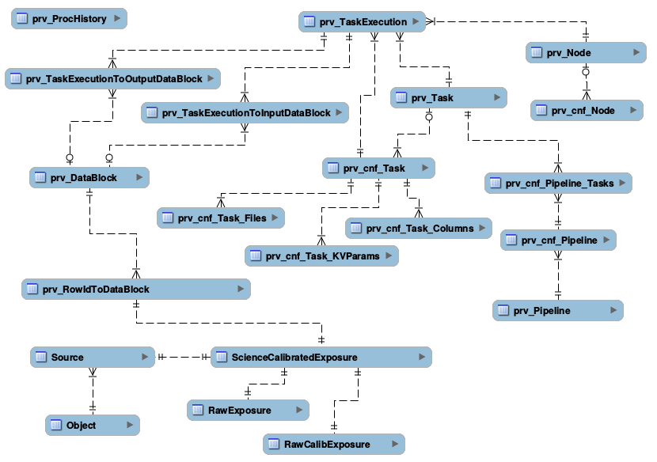

Proof-of-concept prototype of the LSST Provenance
=================================================

This prototype exercises selected aspects of the provenance with goals to
demonstrate how the real system will work, to experiment with the most
difficult parts, and play with the interfaces.

This prototype only covers provenance for:
 1. a subset of LSST catalog: Objects, Sources and ScienceCalibratedExposures
 2. a subset of LSST software: Calibration and Data Release Pipelines that include some dummy tasks and their simplified configurations
 3. a subset of LSST hardware: a few "processing nodes".

and it is meant to outline the mechanics and relationships. It should be straightforward to extend that design to cover the entire catalog, software and hardware space.

To understand how provenance works, one has to consider how LSST data is processed.
 * data is processed throught pipelines
 * a pipeline consists of tasks
 * each task can be executed independently, in parallel on multiple machines; one execution of one task on one machine is called "task execution".
 * data goes through many tasks while it is being processed.

The provenance design relies on the following requirements:
 * underlying configuration of the software and hardware used to process a group of data must be fixed.
 * any given piece of data can only be processed by exactly one task execution of a given type
 * no two task executions can update the same piece of data

In a nutshell, the way provenance "works":
 * Provenance keeps track of all configurations for all pieces of software and hardware, such as which tasks are part of which pipeline, which pipeline produces which tables, which tasks produce which columns. For each of such configurations there is a range of time when it is valid. (example: prv_Task and prv_cnf_Task, or prv_Node and prv_cnf_Node)
 * For each task execution we are creating an entry in provenance that captures which task it is, what node it is running on, and time when the task was started. Note that we don't need to keep track of exact start/stop time of a task, because the configuration is guaranteed to stay unchanged throughout execution of entire task (see prv_TaskExecution)
 * For each group, such as a group of ScienceCalibratedExposures, provenance keeps track which exposures belong to that group. (see prv_SCEGroup and prv_SCEExposureToGroup)
 * As a group is processed by different execution tasks (typically at different times), provenance captures the information which groups are processed by which execution tasks. (see prv_TaskExecutionToSCEGroup)
 * Based on the above:
  * for every ScienceCalibratedExposure we can determine it's group
  * for each group we can determine all task executions that processed a given group
  * based on the information in the task executions, we can determine which nodes processed given data and when.
  * Knowing the time allows us to inspect configuration for any configuration of any piece of hardware or software that we want
 * And based on the schema in our catalog, we can always determine which source corresponds to which exposure, and which object is associated with which sources.
As a result, for every object, every source and every exposure we can determine provenance for any row and any column in these tables.

Note that in this design it is not necessary to maintain any provenance related column(s) in the largest tables such as Source or Object (and alike, eg ForcedSource), such as provHistoryId that was present in the original design. provHistoryId is currently still part of the provenance, but it is only used as a "flag" that something changed: whenever any configuration of anything tracked through provenance changes, a new version of provHistoryId is issued. This allows to quickly determine if anything changed.

Random notes:
 * the current design does not capture which tasks modify which columns. This would look similarly to prv_TableToPipeline table.

To think about:
 * what happens when we update provenance but we have tasks that are running? Should we be updating configurations only when nothing is running? Should we be keeping track of "what changes might affect given task execution", and be only sensitive to the changes that are affecting given task?

Schema Diagram
--------------

